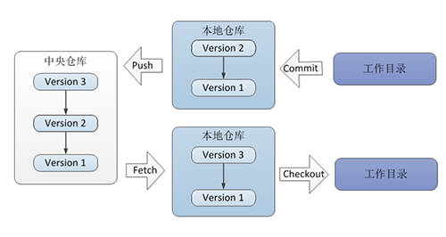

# 第一章 Git基础

## 一、什么是 Git ？
**Linus** 的第二个伟大作品。2005年由于BitKeeper软件公司对Linux社区停止了免费使用权。Linus迫不得已开发自己的版本控制工具，基于使用 BitKeeper 时的经验教训，开发出了 Git。
目前，Eclipse上使用Git的项目数量也已经超过了使用SVN的仓库数。

### Git 的特点
1. 速度快：所有的操作都可以是离线操作，所以速度非常快；
2. 简单的设计：Git 本质上是一个基于内容寻址的文件管理系统，底层概念非常简单；
3.  对非线性开发模式的强力支持：使用方式种类繁多，可自行创造;
4. 有能力高效管理类似 Linux 内核一样的超大规模项目（速度和数据量）;
5. 完全分布式：客户端并不只提取最新版本的文件快照，而是把代码仓库完整地镜像下来。 这么一来，任何一处协同工作用的服务器发生故障，事后都可以用任何一个镜像出来的本地仓库恢复。 因为每一次的克隆操作，实际上都是一次对代码仓库的完整备份。
    

## 二、Git 的基本思想和工作原理
### 1. 直接记录快照，而非差异比较
### 2. 近乎所有操作都是本地执行
### 3. Git 保证完整性
### 4. Git 一般只添加数据
### 5. 文件的三种状态

## 三、Git 的安装
## 四、基本概念与应用

***
